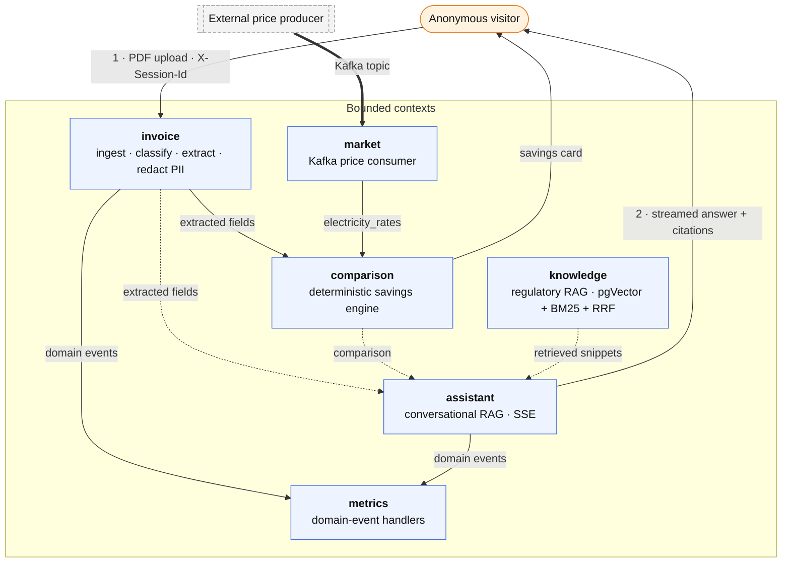

# BillMind

In Spain, millions of households pay more for electricity than they need to — often stuck on a tariff that stopped being the best option years ago. Comparing is the hard part: bills bury the real numbers under peak/off-peak windows, power terms and regulatory line items, so almost nobody checks and the overpayment quietly renews itself every year.

**BillMind is an AI-powered REST API for utility-invoice intelligence.** Upload a Spanish utility invoice PDF and it tells you how much you're overpaying and which tariff is cheaper.

Behind that, it runs the full pipeline: it ingests and classifies the PDF, extracts the fields with an LLM, redacts PII, compares your rates against live market data, and answers follow-up questions grounded in energy regulation.

> **▶ Live demo — [billmindset.com](https://billmindset.com)** · upload a sample invoice, see the savings card, ask a question. No install, no login.


[](https://billmindset.com)


Built with **Spring Boot 3.5.0**, **Java 21** and **LangChain4j 1.0.0**. Runs on **fully local AI** (Ollama, zero cloud) or **cloud providers** (Anthropic, OpenAI, Gemini, Groq) via a single env var. No login required in Phase 1.

**By the numbers:** invoice to savings card in **~10 s** end-to-end · **609** automated tests across **86** classes (6 Testcontainers integration suites) · a **50-case** Spanish RAG quality gate scored on every CI run — context precision **0.82**, retrieval recall@5 **0.97**, [thresholds and all](#quality-gates--the-actual-numbers) · **5** regulatory documents (CNMC, REE, BOE) indexed for retrieval · runs **100% local** or on **4** cloud LLM providers.

<p align="center">
  
  <br>
  <em>The full flow: upload an invoice → instant savings card → ask a question → grounded answer with inline citations.</em>
</p>

> **Why I built this** — I wanted to understand what happens when an LLM stops being the demo and becomes just *one component* of a larger system: how it handles a badly scanned PDF, how you stop a hallucinated value from reaching a savings calculation, and how much every request really costs. So the extraction pipeline produces typed, validated data, the savings math is plain Java with no LLM involved, and retrieval quality is scored in CI so improvements can be measured instead of guessed. None of that was necessary for a personal project — [and that's exactly the point](#why-i-built-this).

**Quick links:** [What it does](#what-it-does) · [Architecture](#architecture-at-a-glance) · [Engineering highlights](#engineering-highlights) · [Quality gates](#quality-gates--the-actual-numbers) · [Roadmap](#roadmap) · [Quick start](#quick-start) · [Docs](#docs) · [Why I built this](#why-i-built-this)

---

## What it does

A visitor uploads a PDF and BillMind runs five stages, all **live today** (Milestones 0–7):

1. **Ingest** — validates real MIME type, extracts text from the PDF.
2. **Classify** — hybrid classifier identifies supply type and provider; rejects non-supply documents.
3. **Extract** — LangChain4j `ChatModel` extracts structured fields via a typed prompt, parsed and validated into a typed record; PII redacted before persisting.
4. **Compare** — deterministic engine cross-references your rates against live market data (Kafka) and quantifies annual overpayment, returned synchronously on upload.
5. **Chat** — conversational RAG explains the result and answers follow-ups, grounded in regulation (CNMC, REE, BOE) with mandatory citations, streamed over SSE.

Personalized provider recommendations and the Phase-2 authenticated experience are on the [roadmap](#roadmap). Run it locally in one command ([Quick start](#quick-start)), then open **http://localhost:8082/chat/**.

---

## Architecture at a glance

Hexagonal Architecture (Ports & Adapters) + DDD. Each bounded context owns its domain; cross-context reactions travel through an **in-process domain-event bus**, never direct calls. The `domain/` layer imports only `java.*` — no Spring, JPA, LangChain4j or Lombok. Full package map and numbered design decisions in [`docs/ARCHITECTURE.md`](docs/ARCHITECTURE.md).



<details>
<summary><b>Source layout</b> (click to expand)</summary>

```
src/main/java/dev/izquierdo/billmind/
├── _shared/          # CQRS bus, domain events, auth, route policy, rate limiter,
│                     # LLM instrumentation + prompt-injection defenses, PII scrubber, sessions
├── invoice/          # BC: ingestion, extraction & persistence          [Complete]
├── assistant/        # BC: conversational RAG + agentic tool calling    [Complete]
├── comparison/       # BC: deterministic savings engine                 [Complete]
├── knowledge/        # BC: regulatory KB ingestion + hybrid retrieval   [Complete]
├── market/           # BC: Kafka market-rate ingestion                  [Complete]
└── metrics/          # BC: domain-event handlers, log-only for now      [Reacting]
```

Each context follows the same `domain/ → application/ → infrastructure/` split. Full breakdown in [`docs/ARCHITECTURE.md`](docs/ARCHITECTURE.md).
</details>

---

## Engineering highlights

Each feature links to its deep dive:

- **Hybrid AI classifier that minimizes LLM calls** — keywords handle the obvious cases; the LLM is invoked only for ambiguous documents. → [Extraction pipeline](docs/PLAN.md#milestone-1--structured-extraction--pii-redaction--complete)
- **Typed extraction, not string parsing** — a per-supply-type prompt returns JSON that is sanitized, deserialized into the sealed `InvoiceFields` record hierarchy and domain-validated; a malformed response gets one JSON-repair round trip before the extraction fails. → [Extraction pipeline](docs/PLAN.md#milestone-1--structured-extraction--pii-redaction--complete)
- **Deterministic savings math** — overpayment, TOU weighting and cheapest-tariff selection are pure Java; the LLM only *explains* the result. → [Savings engine](docs/PLAN.md#milestone-3--comparison-module--savings-engine--complete)
- **Event-driven market ingestion** — a Kafka (KRaft) consumer persists live rates idempotently (a replayed event hits the unique constraint and is dropped, not rewritten), with DLT + domain-error topics. → [`docs/MARKET.md`](docs/MARKET.md)
- **Hybrid retrieval (pgVector + BM25 + RRF)** — cosine similarity fused with Postgres `tsvector` BM25 via Reciprocal Rank Fusion, gated in CI by a per-difficulty recall@5 bar ([numbers below](#quality-gates--the-actual-numbers)). → [Knowledge base](docs/PLAN.md#milestone-2--knowledge-base-ingestion--hybrid-search--market-price-consumer--complete)
- **Agentic tool calling with a manual tool loop** — the assistant decides *what* to retrieve per question via a hardened low-level loop that keeps instrumentation, ports and citations. → [`docs/ASSISTANT.md`](docs/ASSISTANT.md)
- **RAGAS-style eval harness as a CI gate** — a deterministic embedding layer always gates `mvn verify` ([numbers below](#quality-gates--the-actual-numbers)), plus an opt-in LLM-as-judge layer. → [`docs/EVAL.md`](docs/EVAL.md)
- **Swappable LLM provider — one env var** — each provider is a `@ConditionalOnProperty` bean (`LLM_PROVIDER=ollama|anthropic|openai|gemini|groq`); switching costs zero refactoring.
- **Layered security** — authenticate-in-the-filter / authorize-in-the-engine split, three-layer admin guard, per-endpoint token-bucket rate limiter, unified prompt-injection defenses. → [Security model](#security-model) · [`docs/RATELIMIT.md`](docs/RATELIMIT.md)
- **Full LLM observability** — every call timed and fanned out to composable sinks: Actuator `llm.*` meters plus opt-in OpenTelemetry spans to Langfuse. → [`docs/OBSERVABILITY.md`](docs/OBSERVABILITY.md)

### Quality gates — the actual numbers

RAG quality is asserted, not claimed: these thresholds are constants in the test sources, and a value below any of them **fails `./mvnw verify` and the Jenkins build** before an image is ever pushed.

| Metric | Gate (build fails below) | Current | Evaluated over |
|---|:-:|:-:|---|
| **Context precision** — AP@k of chunks whose `docType` is expected | ≥ 0.70 | **0.82** | 50-case Spanish golden set |
| **Context recall** — expected `docType` present in top-k | ≥ 0.90 | **1.00** | 50-case Spanish golden set |
| **Reference coverage** — max cosine, ground-truth answer ↔ retrieved chunk | ≥ 0.62 | **0.73** | 50-case Spanish golden set |
| **Retrieval recall@5** — hybrid pgVector + BM25 + RRF | ≥ 0.70 | **0.97** (29/30) | 30-question retrieval set, also gated per difficulty tier |

Two things this table is deliberately honest about:

- **The gap between gate and current value is headroom, not slack.** Both suites run on **AllMiniLM-L6-v2** (384-dim, local ONNX) so CI needs no cloud LLM and stays deterministic — and that model underperforms production-grade embedders on Spanish regulatory text. Thresholds sit below the observed baseline so a legitimate 2-point drift doesn't turn CI red; the tighter targets to restore once a stronger embedder is pinned are already written down next to the constants ([`RagGoldenSetIT`](src/test/java/dev/izquierdo/billmind/knowledge/infrastructure/adapter/RagGoldenSetIT.java), [`AssistantRagEvalIT`](src/test/java/dev/izquierdo/billmind/eval/AssistantRagEvalIT.java)).
- **MRR@5 is measured and logged per run, but not gated** — recall@5 is the bar that fails the build. The LLM-judge layer (faithfulness ≥ 0.65, answer relevancy ≥ 0.45, fact coverage ≥ 0.55) is opt-in via `EVAL_LLM_ENABLED` and **skipped, never failed**, when off: with no eval model pinned in CI, those thresholds are starting points and publishing a "current value" for them would be noise. Full methodology → [`docs/EVAL.md`](docs/EVAL.md).

---

## Roadmap

Every milestone is independently shippable. **Milestones 0–7 are complete** — the anonymous end-to-end product (upload → savings → chat) works today. Full narrative and rationale in [`docs/PLAN.md`](docs/PLAN.md).

| # | Milestone | Status | Deep dive |
|:-:|---|:-:|---|
| 0 | Foundations — sessions, `Invoice` aggregate, CQRS | ✅ | [PLAN](docs/PLAN.md#milestone-0--foundations--complete) |
| 1 | Structured extraction + PII redaction | ✅ | [PLAN](docs/PLAN.md#milestone-1--structured-extraction--pii-redaction--complete) |
| 2 | Knowledge base + hybrid search + Kafka market consumer | ✅ | [MARKET](docs/MARKET.md) · [PLAN](docs/PLAN.md#milestone-2--knowledge-base-ingestion--hybrid-search--market-price-consumer--complete) |
| 3 | Savings engine (`comparison/`) | ✅ | [PLAN](docs/PLAN.md#milestone-3--comparison-module--savings-engine--complete) |
| 4 | Market **price producer** — the service that publishes to the Kafka topic `market/` consumes | 🔗 own repo | [PLAN](docs/PLAN.md#milestone-4--market-price-producer-separate-service-developed-independently) |
| 5 | Conversational RAG + agentic tools (`assistant/`) | ✅ | [ASSISTANT](docs/ASSISTANT.md) · [PLAN](docs/PLAN.md#milestone-5--assistant-module--conversational-rag--complete) |
| 6 | Eval harness + observability | ✅ | [EVAL](docs/EVAL.md) · [OBSERVABILITY](docs/OBSERVABILITY.md) |
| 7 | Production hardening — Flyway, PII-scrubbed logs, prompt-injection defenses | ✅ | [ARCHITECTURE](docs/ARCHITECTURE.md) · [PLAN](docs/PLAN.md#milestone-7--production-hardening--deployability--complete) |
| 8 | Next.js + Tailwind frontend | ○ optional | [PLAN](docs/PLAN.md#milestone-8--minimal-frontend-optional) |
| 9 | Delegated user identity (Phase 2) | ○ planned | [PLAN](docs/PLAN.md#milestone-9--user-identity-phase-2) |
| 10 | `metrics/` analytics domain | ○ planned | [PLAN](docs/PLAN.md#milestone-10--metrics-analytics-domain) |

Legend: ✅ complete · 🔗 shipped as its own service · ○ planned.

---

## Domain events

Bounded contexts never call each other directly. When `invoice/` ingests a PDF or `assistant/` answers a question, it publishes a `DomainEvent` through a **synchronous in-process bus** (`DomainEventPublisher`), dispatched by exact event class. The `metrics/` context reacts to the upload funnel (`InvoiceIngested` / `InvoiceRejected`, by drop-off reason) and chat engagement (`AssistantQuestionAnswered`, where `citationCount == 0` doubles as a KB coverage-gap signal).

`InvoiceIngested` is published **after** the invoice is persisted, outside the narrow transaction that wrote it. The other two paths never reach the database — a rejected upload is dropped before persistence, and conversations live in memory — so there is no commit to wait for. Payloads carry **only ids, enums and counters — never invoice or message text** — so `metrics/` is PII-free by construction. The design principle and the deferred transactional-outbox trigger are in [`docs/PLAN.md` → Cross-cutting Considerations](docs/PLAN.md#4-cross-cutting-considerations).

---

## Security model

**Anonymous endpoints (Phase 1):** every request carries a client-generated UUID in `X-Session-Id`. The backend uses it to correlate resources (invoices, conversations) but does **not** authenticate the caller.

**Admin endpoints:** BillMind never validates tokens itself — authentication is fully delegated to an external identity microservice: [`user-service`](https://github.com/MiguelA-Izquierdo/user-service), a companion Spring Boot + DDD service written by the same author, whose introspection endpoint answers with the token's subject and roles (`ROLE_USER` / `ROLE_ADMIN` / `ROLE_SUPER_ADMIN`). Authenticating and authorizing are deliberately separate steps, layered three deep so no single bug opens an admin route. **(1)** `JwtAuthFilter` only establishes an identity: it calls `GET <AUTH_EXTERNAL_URL>/introspect` and puts an `ExternalTokenAuthentication` into the `SecurityContext` — it rejects nothing. **(2)** The access **decision** belongs to Spring Security's authorization engine, where `RouteAccessAuthorizationManager` classifies the request through `RouteAccessPolicy`. **(3)** `@PreAuthorize("hasRole('ADMIN')")` on each admin handler enforces it again, independently. A new `/api/v1/admin/**` route is guarded the moment it is mapped — no filter change. `anyRequest().permitAll()` is banned. On top of that, a **per-endpoint token-bucket rate limiter** (bucket4j + Caffeine, pre/post-auth checkpoints) guards every `/api/v1/**` route.

See [`docs/ARCHITECTURE.md`](docs/ARCHITECTURE.md) → *Admin route protection* and [`docs/RATELIMIT.md`](docs/RATELIMIT.md). **Milestone 9** extends the same delegation model to user-facing endpoints rather than adding local JWT validation.

---

## Observability

Micrometer/Actuator metrics and structured logs, served on a separate internal-only management port. Logs stay in the infrastructure layer — no invoice content, PII or credentials, scrubbed at render time by a `%pii` logback converter. Metrics cover PII/classifier/upload timers plus the `llm.*` and `ratelimit.*` families; every LLM call is timed by `TimedChatLanguageModel` and fanned out to composable `LlmTelemetry` sinks (Actuator meters on by default, OTLP spans to Langfuse opt-in). Full reference → [`docs/OBSERVABILITY.md`](docs/OBSERVABILITY.md).

---

## Tech stack

Java 21 · Spring Boot 3.5.0 · LangChain4j 1.0.0 (BOM) · PostgreSQL 16 + pgVector (IVFFlat) · Apache Kafka (KRaft, via `spring-kafka`) · Flyway · Apache PDFBox · Ollama + AllMiniLM-L6-v2 (384-dim embeddings) · JUnit 5 + Mockito + Testcontainers 1.21.4 · JaCoCo 0.8.12.

---

## Quick start

```bash
# Local AI (Ollama), no Kafka — the simplest start
docker compose --profile local-ai up -d

# Local AI (Ollama) + Kafka — requires KAFKA_ENABLED=true in .env
KAFKA_ENABLED=true docker compose --profile local-ai --profile kafka up -d

# Cloud LLM provider (edit LLM_PROVIDER and add the API key in docker-compose.yml)
docker compose up -d
```

Then open **http://localhost:8082/chat/**. The first Ollama start downloads `llama3.2` (~2 GB) before the app is usable. Full setup, profiles and provider switching → [`docs/DOCKER.md`](docs/DOCKER.md).

---

## Tests

```bash
./mvnw test      # unit tests only (surefire excludes *IT)
./mvnw verify    # unit + integration tests (*IT) — this is what CI runs (see CI/CD below)
```

Integration tests (`*IT`) spin up Postgres/pgVector and Kafka through **Testcontainers**, so they need a running Docker daemon (discovered from the active `docker context`, `DOCKER_HOST`, or `~/.testcontainers.properties`). The daemon endpoint is deliberately **not** pinned in `pom.xml` — a host-specific endpoint baked into the build breaks every other machine, CI agents included. Full guide → [`docs/TESTING.md`](docs/TESTING.md).

---

## CI/CD

CI is **Jenkins** — a multibranch pipeline ([`Jenkinsfile`](Jenkinsfile)) that runs `./mvnw verify` on every branch: unit tests, Testcontainers integration suites and the [RAG quality gate](docs/EVAL.md). A red build never reaches the image push, and git tags are immutable — the pipeline refuses to overwrite one that already exists in the registry.

CD lives in a separate repository, [`billmind-infra`](https://github.com/MiguelA-Izquierdo/billmind-infra) (k3s + Kustomize), which deploys the image tag this pipeline publishes. Stages, branch→tag mapping and the rest of the rationale → [`docs/CI.md`](docs/CI.md).

---

## Docs

- Docker setup → [`docs/DOCKER.md`](docs/DOCKER.md)
- Configuration reference → [`docs/CONFIGURATION.md`](docs/CONFIGURATION.md)
- API reference → [`docs/API.md`](docs/API.md)
- Architecture & design decisions → [`docs/ARCHITECTURE.md`](docs/ARCHITECTURE.md)
- Market module → [`docs/MARKET.md`](docs/MARKET.md)
- Assistant module (agentic tool calling) → [`docs/ASSISTANT.md`](docs/ASSISTANT.md)
- Evaluation harness → [`docs/EVAL.md`](docs/EVAL.md)
- Rate limiting → [`docs/RATELIMIT.md`](docs/RATELIMIT.md)
- Observability → [`docs/OBSERVABILITY.md`](docs/OBSERVABILITY.md)
- Test guide → [`docs/TESTING.md`](docs/TESTING.md)
- CI/CD pipeline → [`docs/CI.md`](docs/CI.md)
- Roadmap → [`docs/PLAN.md`](docs/PLAN.md)
- Kubernetes deployment → [`MiguelA-Izquierdo/billmind-infra`](https://github.com/MiguelA-Izquierdo/billmind-infra) (separate infra repo)

---

## Why I built this

I wanted to build something that went beyond another LLM demo.

More than anything, I wanted to understand what happens when an LLM becomes just one component in a larger system: how it handles a badly scanned PDF, how you prevent a hallucinated value from affecting a savings calculation, how you know whether a retrieval pipeline actually improved instead of simply changing, and how much every request really costs.

That mindset shaped the entire project.

The extraction pipeline produces typed, validated data. The savings calculations are plain Java, with no LLM involved. Retrieval quality is evaluated in CI so improvements can be measured instead of guessed. Every LLM call is timed and logged because performance and cost are part of the system, not an afterthought.

The rest of the architecture follows the same philosophy. I deliberately chose technologies that made the project more challenging rather than more convenient: hexagonal architecture with clear boundaries, an event bus instead of direct method calls, Flyway instead of `ddl-auto`, and a Jenkins pipeline deploying to k3s instead of simply running Docker locally.

None of those decisions were necessary for a personal project. I chose them because I wanted the experience of making architectural decisions, defending them, and changing them when they proved to be the wrong choice.

BillMind was never meant to become a product. It was an opportunity to build as if it were one: no fake results, measurable behavior, deterministic business logic where it matters, and no shortcuts on the hard parts.

---

## License

© 2026 Miguel Ángel Izquierdo. All rights reserved.
No license to use, modify or distribute this software is granted. For any other use, get in touch.