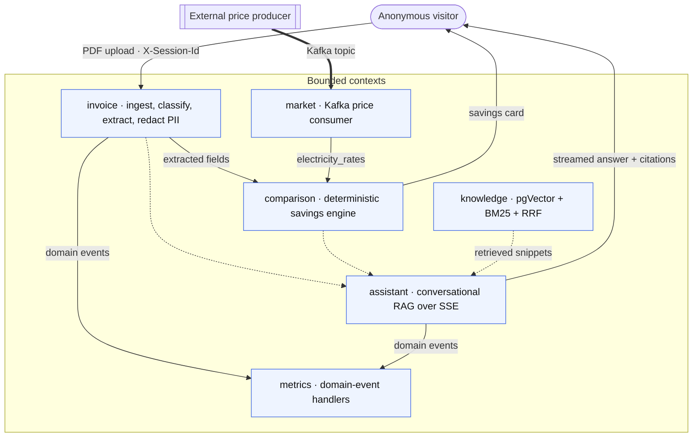

# BillMind

In Spain, millions of households pay more for electricity than they need to — often stuck on a tariff that stopped being the best option years ago. Bills bury the real numbers under peak/off-peak windows, power terms and regulatory line items, so almost nobody checks and the overpayment quietly renews itself every year.

**BillMind is an AI-powered REST API for utility-invoice intelligence.** Upload a Spanish utility invoice PDF and it tells you how much you're overpaying and which tariff is cheaper — ingesting and classifying the PDF, extracting the fields with an LLM, redacting PII, comparing your rates against live market data, and answering follow-up questions grounded in energy regulation.

> **▶ Live demo — [billmindset.com](https://billmindset.com)** · upload a sample invoice, see the savings card, ask a question. No install, no login.

[](https://billmindset.com)


**By the numbers:** invoice to savings card in **~10 s** end-to-end · **724** automated tests across **92** classes (6 Testcontainers integration suites) · a **50-case** Spanish RAG quality gate scored on every CI run — context precision **0.82**, retrieval recall@5 **0.97**, [thresholds and all](docs/ENGINEERING.md#quality-gates) · **5** regulatory documents (CNMC, REE, BOE) indexed for retrieval · runs **100% local** (Ollama, zero cloud) or on **4** cloud LLM providers, switched by one env var.

<p align="center">
  
  <br>
  <em>The full flow: upload an invoice → instant savings card → ask a question → grounded answer with inline citations.</em>
</p>

---

## What it does

A visitor uploads a PDF and BillMind runs five stages, all live today:

1. **Ingest** — validates real MIME type, extracts the text from the PDF.
2. **Classify** — hybrid classifier identifies supply type and provider; rejects non-supply documents.
3. **Extract** — an LLM returns structured fields, parsed and validated into a typed record; PII redacted before persisting.
4. **Compare** — deterministic engine cross-references your rates against live market data (Kafka) and quantifies annual overpayment, returned synchronously on upload.
5. **Chat** — conversational RAG answers follow-ups, grounded in regulation (CNMC, REE, BOE) with mandatory citations, streamed over SSE.

**Status:** milestones 0–7 complete — the anonymous end-to-end product works today, production hardening included (Flyway, PII-scrubbed logs, prompt-injection defenses). Still open: an optional Next.js frontend, delegated user identity, and the analytics domain → [`docs/PLAN.md`](docs/PLAN.md).

---

## Architecture at a glance

Hexagonal Architecture (Ports & Adapters) + DDD. Each bounded context owns its domain; cross-context reactions travel through an **in-process domain-event bus**, never direct calls. The `domain/` layer imports only `java.*` — no Spring, JPA, LangChain4j or Lombok. That is an invariant, not a convention: [`ArchitectureRulesTest`](src/test/java/dev/izquierdo/billmind/architecture/ArchitectureRulesTest.java) enforces domain purity and the inward dependency direction with ArchUnit, so a violation fails the build instead of waiting for a reviewer.



Full package map and numbered design decisions → [`docs/ARCHITECTURE.md`](docs/ARCHITECTURE.md).

---

## Engineering details

Hybrid classification, typed extraction into sealed records, deterministic savings math, hybrid retrieval (pgVector + BM25 + RRF), an agentic tool loop, RAG quality gates that fail the build, a provider swap behind one env var, layered security and per-call LLM observability — each with its reasoning, trade-offs, numbers and code links in [`docs/ENGINEERING.md`](docs/ENGINEERING.md).

---

## Tech stack

Java 21 · Spring Boot 3.5.0 · LangChain4j 1.0.0 (BOM) · PostgreSQL 16 + pgVector (IVFFlat) · Apache Kafka (KRaft, via `spring-kafka`) · Flyway · Apache PDFBox · Ollama + AllMiniLM-L6-v2 (384-dim embeddings) · JUnit 5 + Mockito + Testcontainers · JaCoCo.

---

## Quick start

```bash
docker compose --profile local-ai up -d                          # local AI (Ollama), no Kafka
KAFKA_ENABLED=true docker compose --profile local-ai --profile kafka up -d
docker compose up -d                                             # cloud LLM provider (set LLM_PROVIDER + API key)
```

Then open **http://localhost:8082/chat/**. The first Ollama start downloads `llama3.2` (~2 GB) before the app is usable. Full setup, profiles and provider switching → [`docs/DOCKER.md`](docs/DOCKER.md).

---

## Tests & CI/CD

```bash
./mvnw test      # unit tests only (surefire excludes *IT)
./mvnw verify    # unit + integration tests (*IT) — this is what CI runs
```

Integration tests spin up Postgres/pgVector and Kafka through **Testcontainers**, so they need a running Docker daemon. CI is **Jenkins**: a multibranch pipeline ([`Jenkinsfile`](Jenkinsfile)) runs `./mvnw verify` on every branch, quality gate included, and a red build never reaches the image push. CD lives in a separate repo, [`billmind-infra`](https://github.com/MiguelA-Izquierdo/billmind-infra) (k3s + Kustomize).

---

## Docs

- **Start here** — [Engineering details](docs/ENGINEERING.md) · [Architecture & design decisions](docs/ARCHITECTURE.md) · [API reference](docs/API.md) · [Roadmap](docs/PLAN.md)
- **Run it** — [Docker](docs/DOCKER.md) · [Configuration](docs/CONFIGURATION.md) · [Testing](docs/TESTING.md) · [CI/CD](docs/CI.md) · [Kubernetes](https://github.com/MiguelA-Izquierdo/billmind-infra) (separate infra repo)
- **Modules & subsystems** — [Market](docs/MARKET.md) · [Assistant (agentic tools)](docs/ASSISTANT.md) · [Eval harness](docs/EVAL.md) · [Rate limiting](docs/RATELIMIT.md) · [Observability](docs/OBSERVABILITY.md)

---

## Why I built this

I wanted to build something that went beyond another LLM demo — to understand what happens when an LLM becomes just one component in a larger system: how it handles a badly scanned PDF, how you prevent a hallucinated value from reaching a euro figure, how you know whether a retrieval pipeline actually improved instead of simply changing, and how much every request really costs.

That mindset shaped the whole project. Extraction produces typed, validated data; the savings math is plain Java with no LLM involved; retrieval quality is measured in CI instead of guessed; every LLM call is timed, because cost and latency are part of the system. The architecture follows the same logic — hexagonal boundaries, an event bus instead of direct calls, Flyway instead of `ddl-auto`, Jenkins deploying to k3s. None of it was necessary for a personal project: I chose it for the experience of making architectural decisions, defending them, and changing them when they proved wrong. BillMind was never meant to become a product — it was an opportunity to build as if it were one.

---

## How this was built

Every line of production code in BillMind was implemented with AI assistance — Claude Code as the implementer, me as the engineer directing it: designing the architecture, defining the boundaries, setting the constraints and reviewing every implementation decision. That was the point, not a shortcut. What I found is that the work does not disappear; it moves upstream, to the decisions a model cannot make for you:

- **Where the boundaries go** — which bounded contexts exist, and what may cross between them.
- **What must never touch an LLM** — the savings math is plain Java for a reason; a hallucinated number must not reach a euro figure.
- **What an acceptable failure looks like** — a throttled provider answers `429` with the wait it named, not a `500`, classified at the one point every call already crossed.
- **What "good" means as a number** — the RAG thresholds that fail the build are mine, and so is the reasoning for where each one sits.
- **And, more often than anything else, what not to build.**

Directing also means rejecting. The commit that introduced `LlmFailures` deleted four `catch` blocks a previous round had produced — they worked, but they were fan-out, and they flattened "wait a moment" into "the service is down". Knowing that the working version was the wrong one is the job, and every decision of that kind is written down with its reasoning in [`docs/ARCHITECTURE.md`](docs/ARCHITECTURE.md) and [`docs/ENGINEERING.md`](docs/ENGINEERING.md).

I can defend every line in this repository. I just didn't type them.

---

## License

© 2026 Miguel Ángel Izquierdo. Source-available, not open source — see [`LICENSE`](LICENSE) for the terms that govern.

Clone it, run it, read it, take it apart — that's what it's here for, and quoting it with attribution is welcome. Commercial use, redistribution and hosting it as a service are not granted; for anything along those lines, [get in touch](mailto:izquierdomiguela@gmail.com).