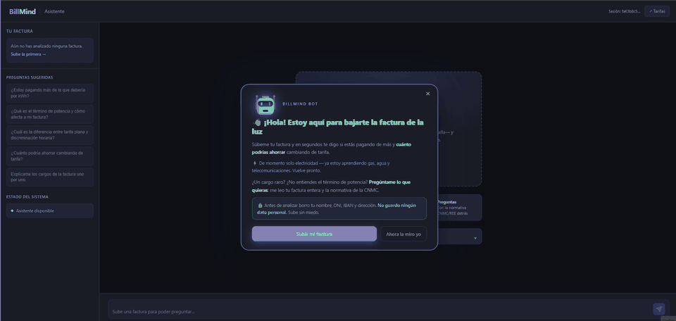

# BillMind

In Spain, millions of households pay more for electricity than they need to — often stuck on a tariff that stopped being the best option years ago. Comparing is the hard part: bills bury the real numbers under peak/off-peak windows, power terms and regulatory line items, so almost nobody checks and the overpayment quietly renews itself every year.

**BillMind is an AI-powered REST API for utility-invoice intelligence.** Upload a Spanish utility invoice PDF and it tells you how much you're overpaying and which tariff is cheaper.

Behind that, it runs the full pipeline: it ingests and classifies the PDF, extracts the fields with an LLM, redacts PII, compares your rates against live market data, and answers follow-up questions grounded in energy regulation.

> **▶ Live demo — [billmindset.com](https://billmindset.com)** · upload a sample invoice, see the savings card, ask a question. No install, no login.

[](https://billmindset.com)


Built with **Spring Boot 3.5.0**, **Java 21** and **LangChain4j 1.0.0**. Runs on **fully local AI** (Ollama, zero cloud) or **cloud providers** (Anthropic, OpenAI, Gemini, Groq) via a single env var. No login required in Phase 1.

**By the numbers:** invoice to savings card in **~10 s** end-to-end · **629** automated tests across **88** classes (6 Testcontainers integration suites) · a **50-case** Spanish RAG quality gate scored on every CI run — context precision **0.82**, retrieval recall@5 **0.97**, [thresholds and all](docs/ENGINEERING.md#quality-gates) · **5** regulatory documents (CNMC, REE, BOE) indexed for retrieval · runs **100% local** or on **4** cloud LLM providers.

<p align="center">
  
  <br>
  <em>The full flow: upload an invoice → instant savings card → ask a question → grounded answer with inline citations.</em>
</p>

**Quick links:** [What it does](#what-it-does) · [Architecture](#architecture-at-a-glance) · [Engineering details](docs/ENGINEERING.md) · [Quick start](#quick-start) · [Docs](#docs) · [Why I built this](#why-i-built-this)

---

## What it does

A visitor uploads a PDF and BillMind runs five stages, all live today:

1. **Ingest** — validates real MIME type, extracts text from the PDF.
2. **Classify** — hybrid classifier identifies supply type and provider; rejects non-supply documents.
3. **Extract** — LangChain4j `ChatModel` extracts structured fields via a typed prompt, parsed and validated into a typed record; PII redacted before persisting.
4. **Compare** — deterministic engine cross-references your rates against live market data (Kafka) and quantifies annual overpayment, returned synchronously on upload.
5. **Chat** — conversational RAG explains the result and answers follow-ups, grounded in regulation (CNMC, REE, BOE) with mandatory citations, streamed over SSE.

Run it locally in one command ([Quick start](#quick-start)), then open **http://localhost:8082/chat/**.

**Status:** the anonymous end-to-end product works today — ingestion and extraction, the knowledge base and Kafka market consumer, the savings engine, the assistant, the eval harness and observability, and production hardening (Flyway, PII-scrubbed logs, prompt-injection defenses). Still open: an optional Next.js frontend, delegated user identity, and the analytics domain. Milestone-by-milestone detail → [`docs/PLAN.md`](docs/PLAN.md).

---

## Architecture at a glance

Hexagonal Architecture (Ports & Adapters) + DDD. Each bounded context owns its domain; cross-context reactions travel through an **in-process domain-event bus**, never direct calls. The `domain/` layer imports only `java.*` — no Spring, JPA, LangChain4j or Lombok. Full package map and numbered design decisions in [`docs/ARCHITECTURE.md`](docs/ARCHITECTURE.md).


<details>
<summary><b>Source layout</b> (click to expand)</summary>

```
src/main/java/dev/izquierdo/billmind/
├── _shared/          # CQRS bus, domain events, auth, route policy, rate limiter,
│                     # LLM instrumentation + prompt-injection defenses, PII scrubber, sessions
├── invoice/          # BC: ingestion, extraction & persistence
├── assistant/        # BC: conversational RAG + agentic tool calling
├── comparison/       # BC: deterministic savings engine
├── knowledge/        # BC: regulatory KB ingestion + hybrid retrieval
├── market/           # BC: Kafka market-rate ingestion
└── metrics/          # BC: domain-event handlers, log-only for now
```

Each context follows the same `domain/ → application/ → infrastructure/` split. Full breakdown in [`docs/ARCHITECTURE.md`](docs/ARCHITECTURE.md).
</details>

---

## Engineering details

The parts that took the most thought, one line each — the reasoning, the trade-offs and the numbers are in [`docs/ENGINEERING.md`](docs/ENGINEERING.md).

- **Hybrid classifier** — keywords first, the LLM only for ambiguous documents.
- **Typed extraction** — JSON → sealed `InvoiceFields` records, domain-validated, one repair round trip on malformed output.
- **Deterministic savings math** — pure Java; the LLM only *explains* the result.
- **Hybrid retrieval** — pgVector cosine + Postgres BM25 fused with RRF, gated in CI by recall@5.
- **Agentic tool calling** — a manual tool loop that keeps instrumentation, ports and citations.
- **RAG quality gates** — context precision, recall and reference coverage fail `mvn verify` when they drop.
- **Swappable LLM provider** — `@ConditionalOnProperty` beans; one env var, zero refactoring.
- **Layered security** — authenticate in the filter, authorize in the engine, `@PreAuthorize` as a third layer, plus a per-endpoint rate limiter.
- **LLM observability** — every call timed into composable sinks: Actuator meters, opt-in OTLP spans to Langfuse.

---

## Tech stack

Java 21 · Spring Boot 3.5.0 · LangChain4j 1.0.0 (BOM) · PostgreSQL 16 + pgVector (IVFFlat) · Apache Kafka (KRaft, via `spring-kafka`) · Flyway · Apache PDFBox · Ollama + AllMiniLM-L6-v2 (384-dim embeddings) · JUnit 5 + Mockito + Testcontainers 1.21.4 · JaCoCo 0.8.12.

---

## Quick start

```bash
# Local AI (Ollama), no Kafka — the simplest start
docker compose --profile local-ai up -d

# Local AI (Ollama) + Kafka — requires KAFKA_ENABLED=true in .env
KAFKA_ENABLED=true docker compose --profile local-ai --profile kafka up -d

# Cloud LLM provider (edit LLM_PROVIDER and add the API key in docker-compose.yml)
docker compose up -d
```

Then open **http://localhost:8082/chat/**. The first Ollama start downloads `llama3.2` (~2 GB) before the app is usable. Full setup, profiles and provider switching → [`docs/DOCKER.md`](docs/DOCKER.md).

---

## Tests & CI/CD

```bash
./mvnw test      # unit tests only (surefire excludes *IT)
./mvnw verify    # unit + integration tests (*IT) — this is what CI runs
```

Integration tests (`*IT`) spin up Postgres/pgVector and Kafka through **Testcontainers**, so they need a running Docker daemon. CI is **Jenkins** — a multibranch pipeline ([`Jenkinsfile`](Jenkinsfile)) that runs `./mvnw verify` on every branch, including the [RAG quality gate](docs/ENGINEERING.md#quality-gates); a red build never reaches the image push. CD lives in a separate repository, [`billmind-infra`](https://github.com/MiguelA-Izquierdo/billmind-infra) (k3s + Kustomize).

Details → [`docs/TESTING.md`](docs/TESTING.md) · [`docs/CI.md`](docs/CI.md).

---

## Docs

- Engineering details (implementation notes, quality gates, domain events, security, observability) → [`docs/ENGINEERING.md`](docs/ENGINEERING.md)
- Architecture & design decisions → [`docs/ARCHITECTURE.md`](docs/ARCHITECTURE.md)
- API reference → [`docs/API.md`](docs/API.md)
- Docker setup → [`docs/DOCKER.md`](docs/DOCKER.md)
- Configuration reference → [`docs/CONFIGURATION.md`](docs/CONFIGURATION.md)
- Market module → [`docs/MARKET.md`](docs/MARKET.md)
- Assistant module (agentic tool calling) → [`docs/ASSISTANT.md`](docs/ASSISTANT.md)
- Evaluation harness → [`docs/EVAL.md`](docs/EVAL.md)
- Rate limiting → [`docs/RATELIMIT.md`](docs/RATELIMIT.md)
- Observability → [`docs/OBSERVABILITY.md`](docs/OBSERVABILITY.md)
- Test guide → [`docs/TESTING.md`](docs/TESTING.md)
- CI/CD pipeline → [`docs/CI.md`](docs/CI.md)
- Roadmap → [`docs/PLAN.md`](docs/PLAN.md)
- Kubernetes deployment → [`MiguelA-Izquierdo/billmind-infra`](https://github.com/MiguelA-Izquierdo/billmind-infra) (separate infra repo)

---

## Why I built this

I wanted to build something that went beyond another LLM demo.

More than anything, I wanted to understand what happens when an LLM becomes just one component in a larger system: how it handles a badly scanned PDF, how you prevent a hallucinated value from affecting a savings calculation, how you know whether a retrieval pipeline actually improved instead of simply changing, and how much every request really costs.

That mindset shaped the entire project.

The extraction pipeline produces typed, validated data. The savings calculations are plain Java, with no LLM involved. Retrieval quality is evaluated in CI so improvements can be measured instead of guessed. Every LLM call is timed and logged because performance and cost are part of the system, not an afterthought.

The rest of the architecture follows the same philosophy. I deliberately chose technologies that made the project more challenging rather than more convenient: hexagonal architecture with clear boundaries, an event bus instead of direct method calls, Flyway instead of `ddl-auto`, and a Jenkins pipeline deploying to k3s instead of simply running Docker locally.

None of those decisions were necessary for a personal project. I chose them because I wanted the experience of making architectural decisions, defending them, and changing them when they proved to be the wrong choice.

BillMind was never meant to become a product. It was an opportunity to build as if it were one: no fake results, measurable behavior, deterministic business logic where it matters, and no shortcuts on the hard parts.

---

## License

© 2026 Miguel Ángel Izquierdo. All rights reserved.
No license to use, modify or distribute this software is granted. For any other use, get in touch.