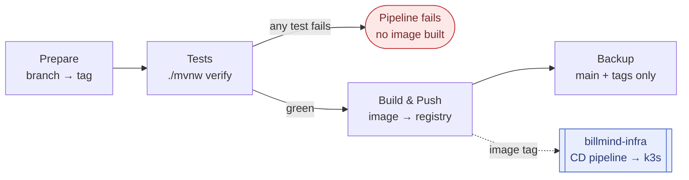

# CI/CD

CI is **Jenkins**, not GitHub Actions: a multibranch pipeline driven by the [`Jenkinsfile`](../Jenkinsfile) at the repo root, running on a `docker-enabled` agent with JDK 21. CD lives in a separate infrastructure repository — this repo builds and publishes the image, [`billmind-infra`](https://github.com/MiguelA-Izquierdo/billmind-infra) deploys it (the standard two-pipeline app/infra split).

---

## Stages

### 1. Prepare

Derives the image tag from the ref and exports it as `DOCKER_TAG`. Nothing is built here.

### 2. Tests

`./mvnw -B --no-transfer-progress verify` — unit tests, the Testcontainers integration suites (`*IT`) and the [50-case RAG quality gate](EVAL.md). **Nothing is published until the whole suite is green:** the declarative pipeline fails fast, so a red build never reaches `Build & Push`.

Results are published from both `surefire` and `failsafe` reports. JaCoCo coverage is recorded on `main` only.

### 3. Build & Push

Runs only for the refs that produce an image (see the table below). The image build **skips tests** (`./mvnw package -DskipTests`): they already ran in the previous stage against the same commit, so re-running them inside the packaging step would double the pipeline time without validating anything new. The `Dockerfile` skips them for the same reason.

The registry is a build parameter (`REGISTRY`, default `192.168.1.100:5000`), with credentials injected from the Jenkins credential store — never hardcoded.

### 4. Backup

`main` and git tags only: `docker save | gzip` into `BACKUP_PATH` (default `/opt/docker-backups/billmind`), followed by `docker image prune -f`.

---

## Branch → image tag

Every branch is tested; only these produce an image:

| Ref | Image tag | Build & Push | Backup |
|---|---|:-:|:-:|
| Git tag (`v1.2.0`) | the tag name | ✅ — immutable, see below | ✅ |
| `main` | `latest` | ✅ | ✅ |
| `develop` | `beta` | ✅ | — |
| `feature/*` | `alpha` | ✅ | — |
| anything else | branch name, `/` → `-` | — tests only | — |

---

## Deliberate choices

- **Git tags are immutable.** Before a tag build pushes, the pipeline queries the registry manifest API (`GET /v2/billmind/manifests/<tag>`) and **fails** if that tag already exists. A moving tag means a release you can no longer reproduce or roll back to.
- **A failed run leaves nothing behind.** `post { failure }` removes the image from the agent, and `cleanWs()` wipes the workspace on every outcome.
- **The Testcontainers daemon endpoint is not pinned** in `pom.xml` — a host-specific endpoint baked into the build breaks every other machine, CI agents included. It is discovered from the active `docker context`, `DOCKER_HOST` or `~/.testcontainers.properties`. See [`TESTING.md`](TESTING.md).

---

## Deployment (CD)

[**MiguelA-Izquierdo/billmind-infra**](https://github.com/MiguelA-Izquierdo/billmind-infra) — k3s manifests (Kustomize): namespace, ConfigMap, Secret template, Deployment, Service, Ingress, plus the CD `Jenkinsfile` that consumes the image tag published above.

Keep infrastructure-as-code in `billmind-infra`; do not add cluster manifests to this repo.